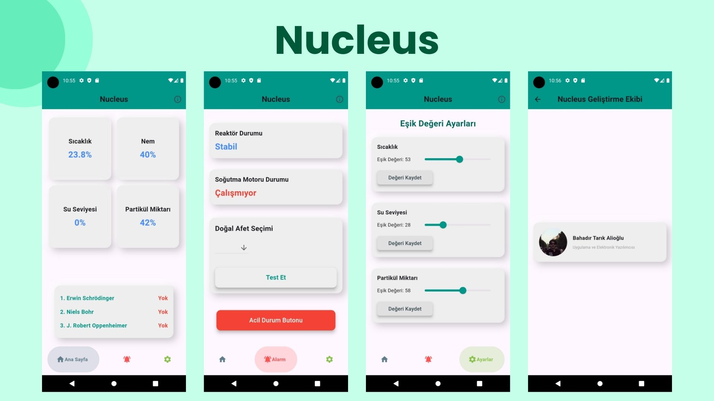

# Nucleus Project
<br>
<div style="text-align:center;">
    
</div>
<br>
Nucleus is a security protocol conceptualized for a competition setting rather than real-world deployment in nuclear facilities. It is not a real defense system it is a concept like smart home. This prototype integrates RFID for access control, MQ-2 gas sensors for detecting gas leaks, water sensors for flood detection, and DHT11 sensors for monitoring temperature and humidity. Data collected is stored in a Firebase database and visualized through a Flutter mobile application.


## Table of Contents

- [Introduction](#introduction)
- [Features](#features)
- [Hardware Components](#hardware-components)
- [Software Components](#software-components)
- [Installation](#installation)
- [Usage](#usage)
- [Contributing](#contributing)
- [License](#license)

## Introduction

Nucleus aims to simulate and enhance safety protocols in a fictional nuclear facility for competition purposes not for real use, integrating advanced sensor technology and real-time data monitoring. The project focuses on demonstrating early detection capabilities for potential hazards like gas leaks and flooding, alongside stringent access control measures.

## Features

- **RFID Access Control**: Only authorized personnel can access secure areas.
- **Gas Leak Detection**: MQ-2 sensor monitors and reports gas levels.
- **Flood Detection**: Water sensor alerts in case of potential flooding.
- **Temperature and Humidity Monitoring**: DHT11 sensor provides real-time environmental data.
- **Real-Time Data Logging**: All data is stored in a Firebase database.
- **Mobile Monitoring**: A Flutter app allows remote monitoring of the facility's status.

## Hardware Components

- Deneyap Kart (x2) or ESP32 
- RFID Reader (MFRC522)
- MQ-2 Gas Sensor
- Water Sensor
- DHT11 Temperature and Humidity Sensor
- Servo Motor
- RGB LED
- Buzzer
- Various connecting wires, resistors and LEDs

## Software Components

- Arduino IDE for programming the Deneyap Kart or ESP32
- Firebase for real-time database
- Flutter for the mobile application
- Libraries:
  - `Adafruit_Sensor`
  - `DHT`
  - `SPI`
  - `MFRC522`
  - `Deneyap_Servo` or Servo library for ESP32
  - `Firebase_ESP_Client`

## Installation

1. **Clone the repository:**
   ```bash
   git clone https://github.com/bahadirtrkalioglu/nucleus.git
   cd nucleus
   ```

2. **Install the required Arduino libraries:**
   - Open Arduino IDE and go to `Sketch -> Include Library -> Manage Libraries`.
   - Search for and install the following libraries:
     - Adafruit Sensor
     - DHT sensor library
     - SPI
     - MFRC522
     - Deneyap_Servo or Servo library for ESP32
     - Firebase ESP Client

3. **Set up Firebase:**
   - Create a Firebase project and configure the Realtime Database.
   - Obtain your Firebase API key and Database URL.

4. **Configure WiFi and Firebase settings:**
   - Open electronics/sender and electronics/alarm in Arduino IDE.
   - Replace the placeholder values with your WiFi credentials and Firebase configuration:
     ```cpp
     #define WIFI_SSID wifiSSID
     #define WIFI_PASSWORD wifiPass
     #define API_KEY apiKey
     #define DATABASE_URL databaseURL
     ```

5. **Upload the code to Deneyap Kart or ESP32:**
   - Connect your Deneyap Kart or ESP32 to your computer.
   - Select the appropriate board and port in Arduino IDE.
   - Click `Upload` to upload the code.

5. **Install Flutter Packages:**
    ```bash
    flutter pub get
    ```


6. **Put Your Firebase File**:
    - You can get your files by creating Firebase project.
    google-services.json file to android/app
    GoogleService-Info.plist file to ios/Runner

8. **Run Nucleus**
    ```bash
    flutter run
    ```


## Usage

1. **Power up the system:**
   - Ensure all sensors and actuators are properly connected.
   - Power up the Deneyap Kart or ESP32.

2. **Monitor through the mobile app:**
   - Open the Nucleus mobile app.
   - Monitor real-time data and alerts from the Firebase database.

## Contributing

Contributions are welcome! Please fork the repository and use a feature branch. Pull requests are reviewed actively.

## License

This project is licensed under the GPL-3.0 License.
